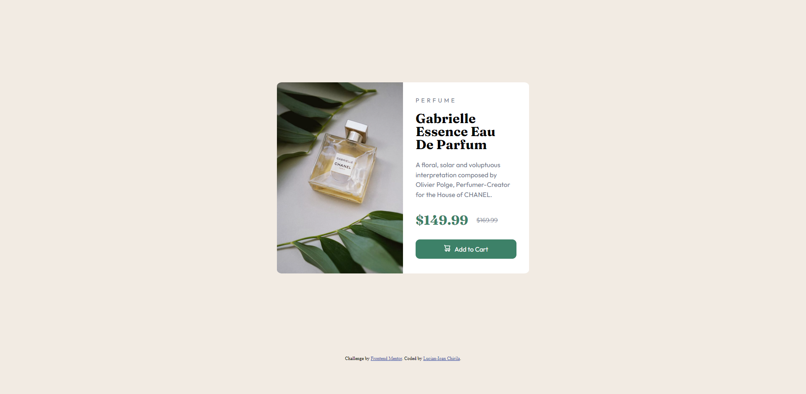

# Frontend Mentor - Profile card component solution

This is a solution to the [Profile card component challenge on Frontend Mentor](https://www.frontendmentor.io/challenges/profile-card-component-cfArpWshJ). Frontend Mentor challenges help you improve your coding skills by building realistic projects. 

## Table of contents

- [Overview](#overview)
  - [The challenge](#the-challenge)
  - [Screenshot](#screenshot)
  - [Links](#links)
- [My process](#my-process)
  - [Built with](#built-with)
  - [What I learned](#what-i-learned)
  - [Continued development](#continued-development)
  - [Useful resources](#useful-resources)
- [Author](#author)
- [Acknowledgments](#acknowledgments)

**Note: Delete this note and update the table of contents based on what sections you keep.**

## Overview

### The challenge

- Build out the project to the designs provided

### Screenshot

### Links

- Solution URL: [https://lucianioan31.github.io/Product-preview-card-component/]
- Live Site URL: [https://lucianioan31.github.io/Product-preview-card-component/]

## My process

### Built with

- Semantic HTML5 markup
- UL lists 
- used some center stuffs from the feedback I got on my last solution (https://www.frontendmentor.io/solutions/crazy-grid-qr-code-creation-fE_97-JdYg#feedback)
- still had problems with centering the card (I had to gave my flex container a height of 100vh)
- Flexbox
- pseudo-class selectors
- I use Smart color picker chrome extension so I can pick the perfect colors (https://chrome.google.com/webstore/detail/smart-color-picker/ilifjbbjhbgkhgabebllmlcldfdgopfl)

### What I learned

Centering wasn't that stressful anymore. Still had some struggles, but I could feel a progress since the last project.

I have find a good way to change from an image to another when resizing browser's window. 

My container's height was 100vh. Because of that my footer couldn't been seen. Had the inspiration to change it to 90vh so I can make some space for my little  footer. :D

### Continued development

Maybe I should fix things about flexbox. I am still using a cheat sheet I have from csstricks.com.

### Useful resources

- [Example resource 1]((https://www.frontendmentor.io/solutions/crazy-grid-qr-code-creation-fE_97-JdYg#feedback)) - This helped me when I wanted to center the flex items. 
- [Example resource 2]((https://www.w3schools.com/css/css_rwd_mediaqueries.asp)) - this is something I use very often in order to remember the media queries syntax. hahaha
- [Example resource 3]((https://developer.mozilla.org/en-US/docs/Web/CSS/object-position)) - Forgot that I have a different image for the mobile version, so until I have remembered that, I was trying to reposition and resize the desktop image. :D:D
- [Example resource 4]((https://css-tricks.com/replace-the-image-in-an-img-with-css/)) - this was an 'aha' moment. Really usefull for the problem I had. (related to example resource 3).

## Author
- Frontend Mentor - [@LucianIoan31](https://www.frontendmentor.io/profile/LucianIoan31)
- GitHub - [@LucianIoan31](https://github.com/LucianIoan31)

## Acknowledgments

Be proud whenever feel that you became more confident on some concepts and pat yourself when you creat even the most banal thing. 

